<div align="center">


<h1>Azure Virtual Desktop (AVD) Image Factory</h1>

<p><strong>Automated Golden Image Lifecycle & Global Distribution Orchestration</strong></p>

[](https://devopstrio.co.uk/)
[](https://devopstrio.co.uk/)
[](https://devopstrio.co.uk/)
[](/apps/build-engine)

</div>

---

## 🏛️ Executive Summary

The **AVD Image Factory** is a flagship enterprise platform designed to automate the most critical component of a desktop virtualization estate: the golden image. In large-scale AVD environments, manual image creation is the leading cause of security drift, application instability, and operational bottlenecks.

This platform provides an automated, "Infrastructure as Code" approach to the image lifecycle. By leveraging **HashiCorp Packer**, **Azure Compute Gallery**, and **App Layering** techniques, it enables organizations to build, harden, patch, test, and distribute secure Windows 11 images globally in a fraction of the time. The factory ensures that every session host in the fleet is built from a verified, compliant, and optimized baseline, drastically reducing incident rates and improving the end-user experience.

### Strategic Business Outcomes
- **Eliminate Security Drift**: Ensure 100% compliance with CIS benchmarks and corporate hardening standards through automated build-time validation.
- **Rapid Patching & Remediation**: Reduce the window of vulnerability by automating the monthly OS and application patch cycle with zero manual intervention.
- **Global Consistency**: Automatically replicate golden images across multiple Azure regions to support disaster recovery and global workforce requirements.
- **Fail-Safe Rollbacks**: Maintain versioned image artifacts in the Azure Compute Gallery, enabling instant rollback to a previous known-good state if an update causes issues.

---

## 🏗️ Technical Architecture Details

### 1. High-Level Image Factory Architecture
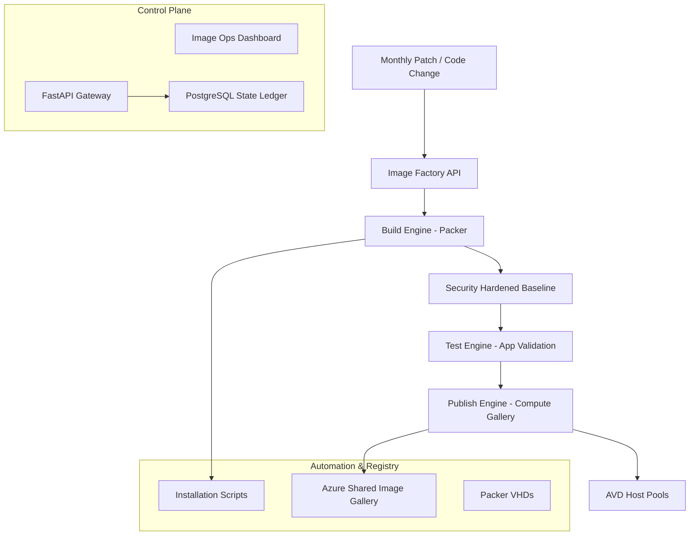

### 2. Image Build Workflow (Packer)
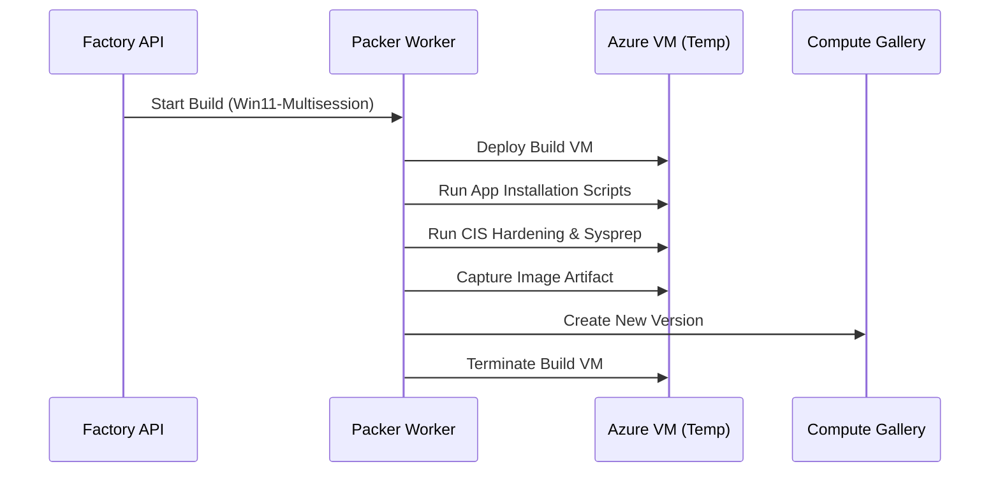

### 3. Patch Ring Lifecycle
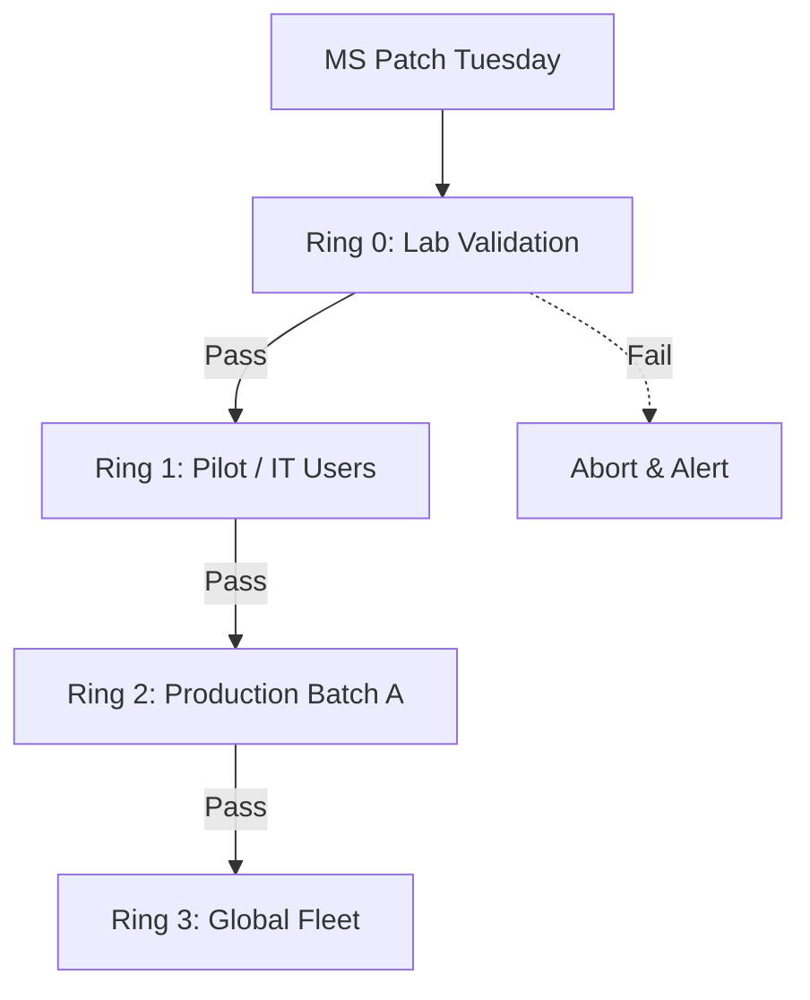

### 4. Test Validation Flow
```mermaid
graph LR
    Image[New Image Version] --> Boot[Boot Test]
    Boot --> Login[Synthetic Login Test]
    Login --> Apps[App Launch Checks]
    Apps --> Performance[Benchmarking (Disk/IO)]
    Performance --> Pass[Mark as Verified]
```

### 5. Publish Replication Flow
```mermaid
graph TD
    Hub[UK South (Source)] --> Master[Image Version v1.2.0]
    Master --> Rep1[US East Replication]
    Master --> Rep2[Japan East Replication]
    Master --> Rep3[Australia East Replication]
    Rep1 --> Pool[Regional Host Pools]
```

### 6. Security Trust Boundary
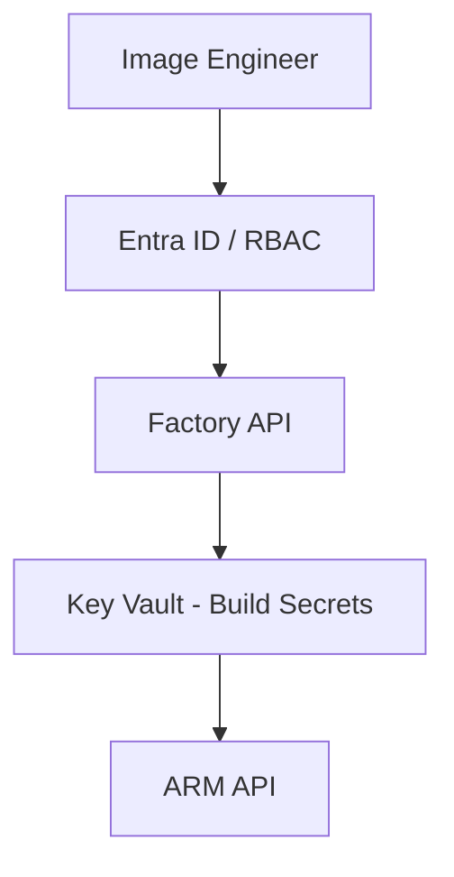

### 7. AVD Enterprise Topology
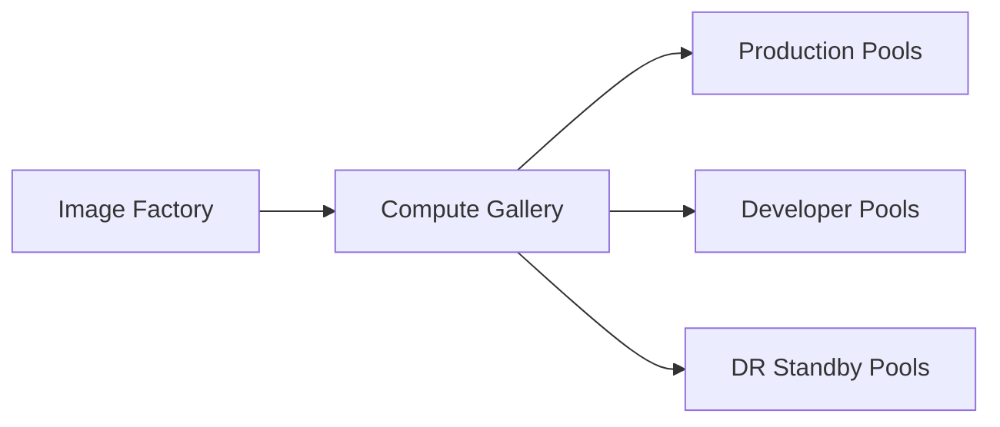

### 8. API Request Lifecycle
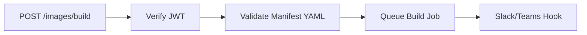

### 9. Multi-Tenant Tenancy Model
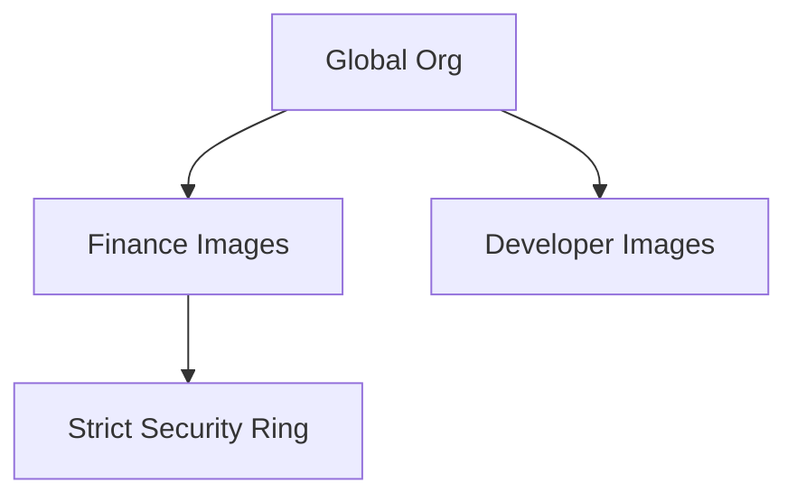

### 10. Monitoring & Telemetry Flow
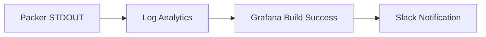

### 11. Disaster Recovery Topology
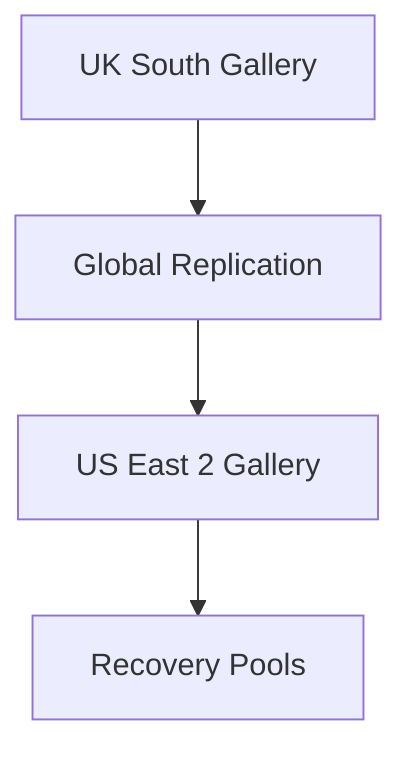

### 12. Rollback Workflow
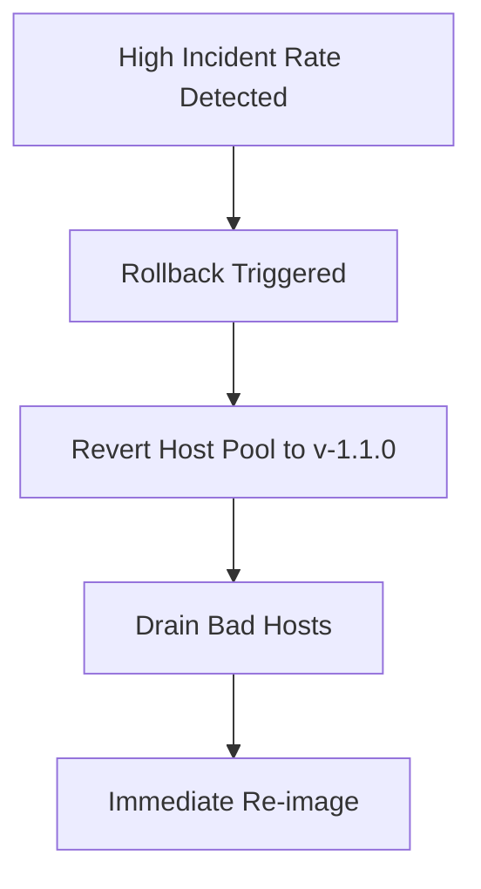

### 13. App Layering Flow
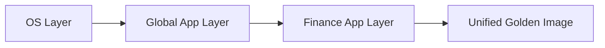

### 14. CI/CD Operations Pipeline
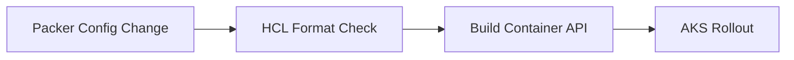

### 15. Executive Governance Workflow
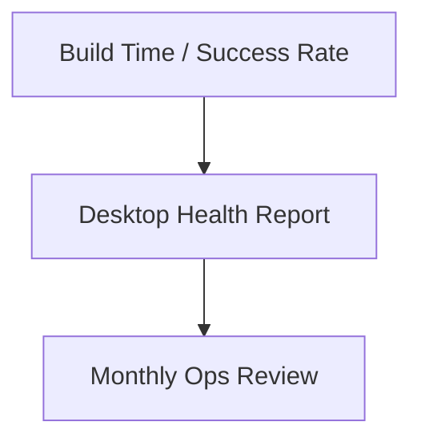

### 16. Host Pool Assignment Flow
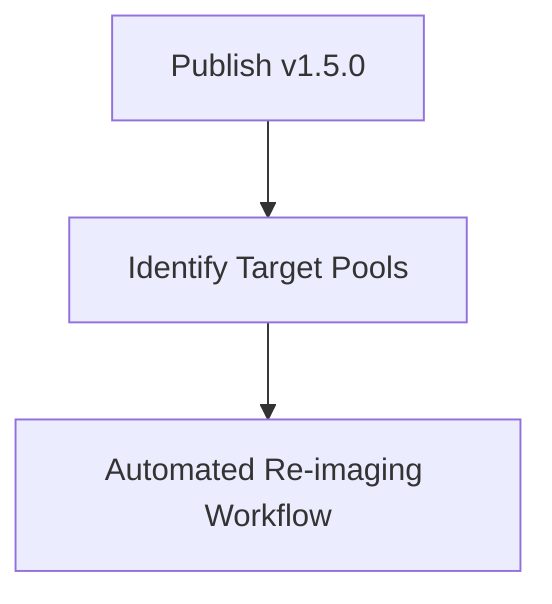

### 17. Identity Federation Model
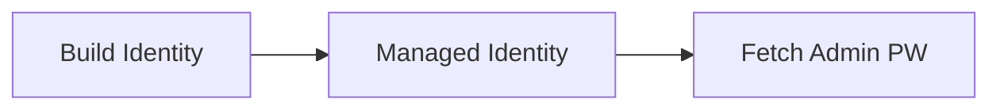

### 18. Compliance Drift Workflow
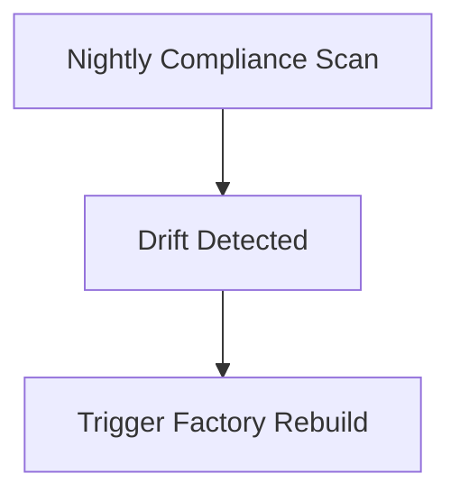

### 19. Global Region Topology
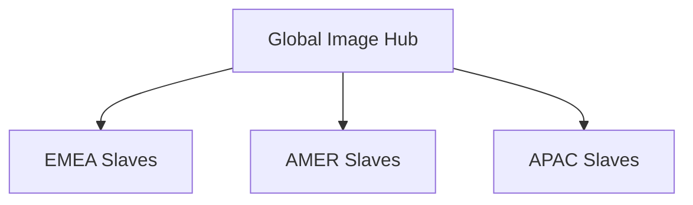

### 20. Version Lifecycle Model
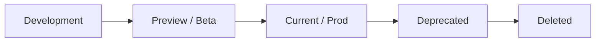

---

## 🚀 Environment Deployment

### Terraform Orchestration
```bash
cd terraform/environments/prd
terraform init
terraform apply -auto-approve
```

---
<sub>&copy; 2026 Devopstrio &mdash; Engineering Standardized Digital Workspace Excellence.</sub>
