<div align="center">


<h1>AVD Image Factory</h1>

<p><strong>The Institutional-Grade Platform for Standardized Image Foundations, Immutable Governance, and Multi-Cloud EUC Ecosystems.</strong></p>

[]()
[]()
[]()

<br/>

> **"Industrializing image creation to automate digital workplace foundations."** 
> **AVD Image Factory** is an enterprise-grade platform designed to provide a secure, measurable, and highly automated foundation for global virtual desktop operations. It orchestrates the complex lifecycle of golden images—from automated packer builds and multi-cloud gallery reconciliation to high-throughput validation intelligence and unified EUC auditing.

</div>

---

## 🏛️ Executive Summary

Fragmented image baselines and manual patching orchestration are strategic operational liabilities; lack of a standardized image framework is a primary barrier to organizational engineering maturity. Organizations fail to secure their virtual desktops not because of a lack of updates, but because of fragmented evaluation standards, lack of automated image reconciliation, and an inability to orchestrate immutable planes with operational precision.

This platform provides the **Image Intelligence Plane**. It implements a complete **AVD-Image-Factory-as-Code Framework**, enabling CTOs and EUC Architects to manage global image foundations as first-class citizens. By automating the identification of compliance regressions through real-time telemetry analysis and orchestrating the provisioning of secure performance-driven image policies, we ensure that every organizational host—from core office pools to edge engineering clusters—is built by default, audited for history, and strictly aligned with institutional EUC frameworks.

---

## 📐 Architecture Storytelling: Principal Reference Models

### 1. Principal Architecture: Global Image Factory & Intelligence Plane
This diagram illustrates the high-level relationship between the Build Engine (Packer), the Security Hardening Layer, and the underlying Azure Compute Gallery. It defines the bridge between image code and the virtual desktop substrate.

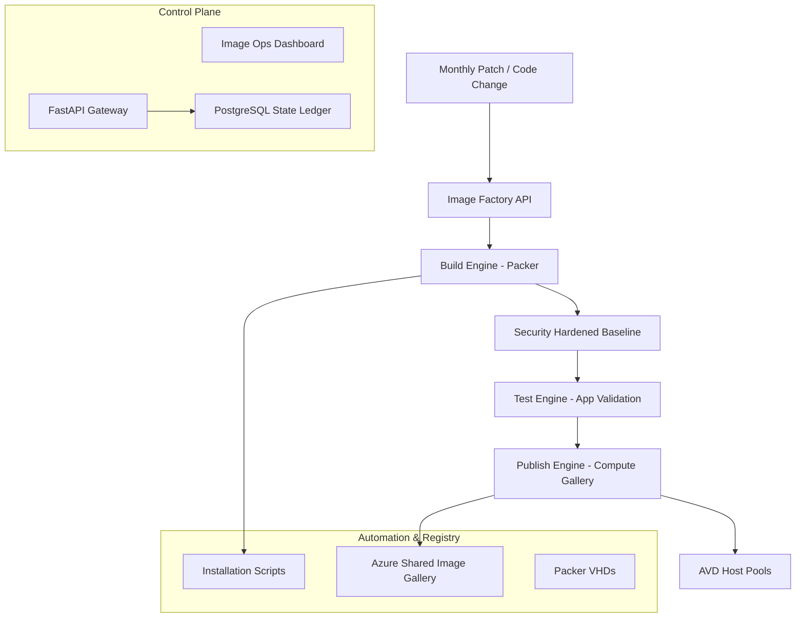

### 2. The Image Lifecycle Flow (Build & Patch Rings)
The continuous path of a golden image from initial packer trigger and application layering to patch ring distribution and version lifecycle decommissioning. This ensures zero-interruption operations through dependency-aware build flows.

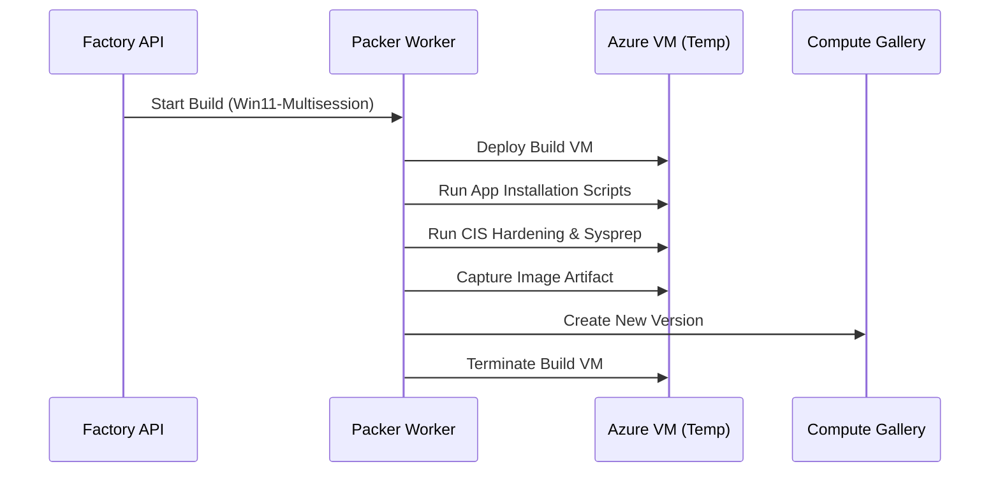

**Patch Ring Lifecycle:**
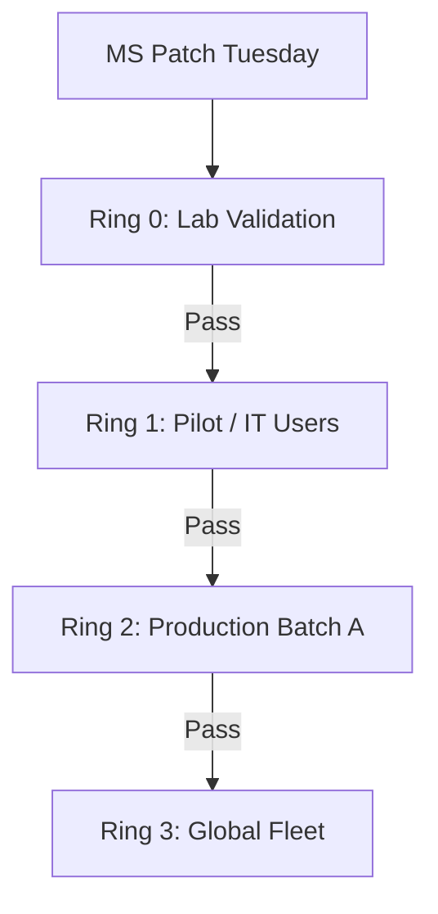

**Version Lifecycle Model:**
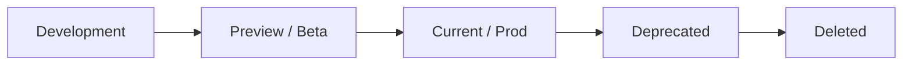

**App Layering & Assignment Flow:**
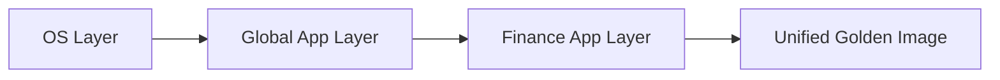

### 3. Distributed Image Topology (Global Gallery & Replication)
Strategically orchestrating standardized images across global regions (UK, US, Japan) and diverse resource architecture nodes, providing a unified institutional view of image readiness.

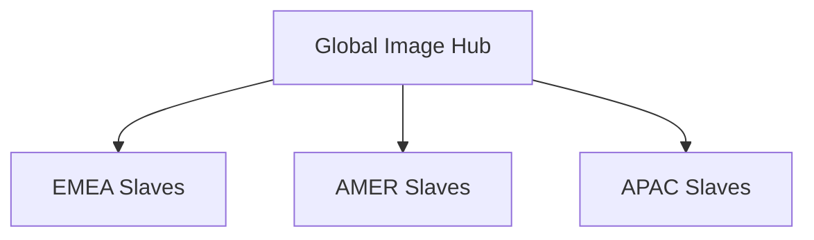

**Publish Replication Flow:**
```mermaid
graph TD
    Hub[UK South (Source)] --> Master[Image Version v1.2.0]
    Master --> Rep1[US East Replication]
    Master --> Rep2[Japan East Replication]
    Master --> Rep3[Australia East Replication]
    Rep1 --> Pool[Regional Host Pools]
```

### 4. Governance Hub & Control Plane Flow
Executing complex logic for securing the bridge between image requests and Azure galleries, ensuring every manifest is validated, builds are queued, and executive oversight is maintained.


**Executive Governance Workflow:**
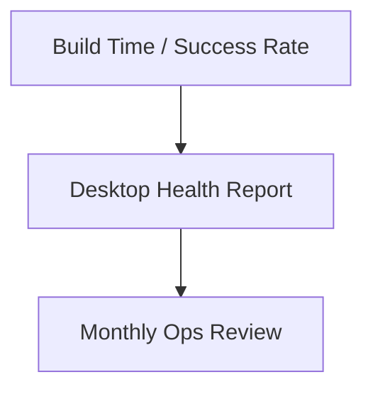

### 5. Multi-Cloud Image Federation & Global Topology
Automatically managing unified image standards across diverse cloud tenants and global regions, ensuring institutional data residency and privacy boundaries by default.

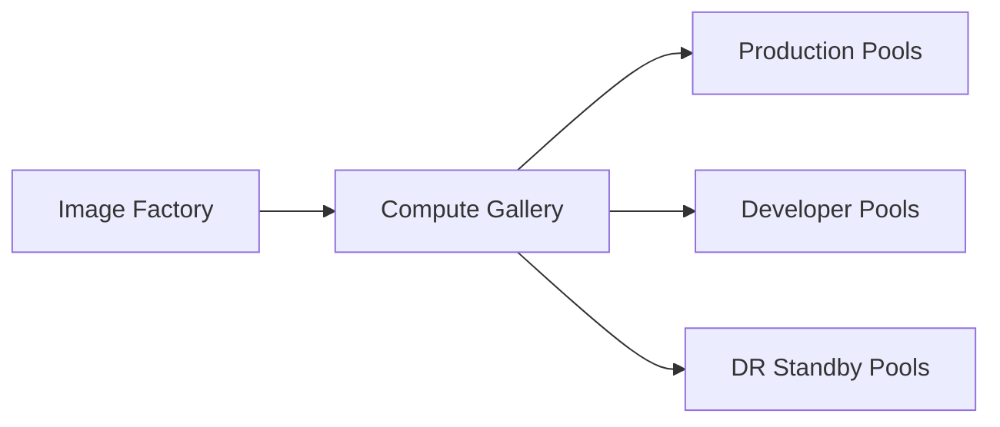

### 6. Encryption & Perimeter Protection Flow (Security Trust Boundary)
Managing the lifecycle of an image request, automatically enforcing institutional RBAC and Key Vault encryption standards as required by security policy, ensuring zero-latency security confidence.

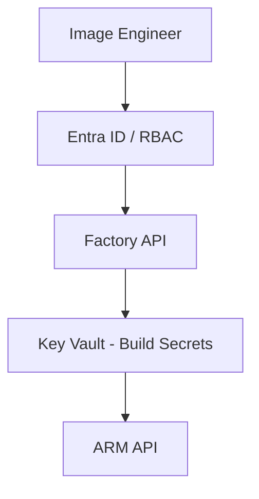

### 7. Institutional Image Maturity Scorecard (Validation Engine)
Grading organizational performance based on key indicators: Build Success Rate, Boot Test Compliance, and Image Health Scorecards.

```mermaid
graph LR
    Image[New Image Version] --> Boot[Boot Test]
    Boot --> Login[Synthetic Login Test]
    Login --> Apps[App Launch Checks]
    Apps --> Performance[Benchmarking (Disk/IO)]
    Performance --> Pass[Mark as Verified]
```

### 8. Identity & RBAC for Image Governance
Managing fine-grained access to build hubs, provisioning workers, and audit logs between Build Engineers and Managed Service Identities.

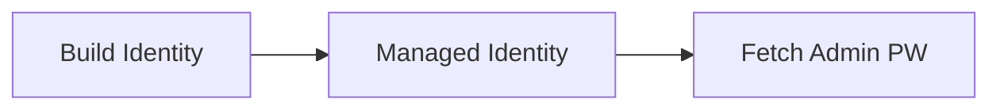

**Multi-Tenant Tenancy Model:**
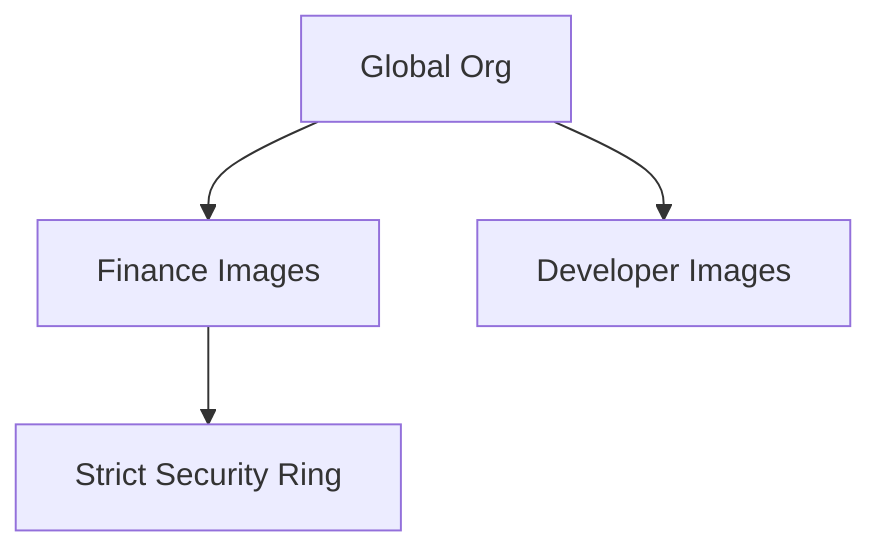

### 9. IaC Deployment: AVD-Image-Factory-as-Code Framework
Using modular CI/CD pipelines to deploy and manage the versioned distribution of the Packer configurations, HCL formats, and validation fleets.

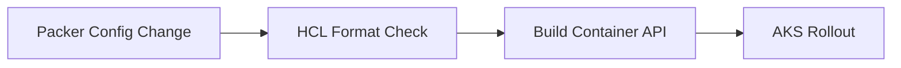

### 10. AIOps Image Drift & Risk Validation Flow
Using advanced analytics to identify sudden surges in build failures, unauthorized image changes, or unusual delivery pattern changes that could result in institutional risk or downtime.

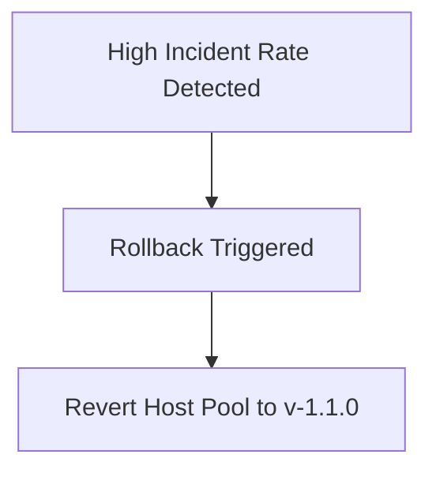

**Compliance Drift Workflow:**
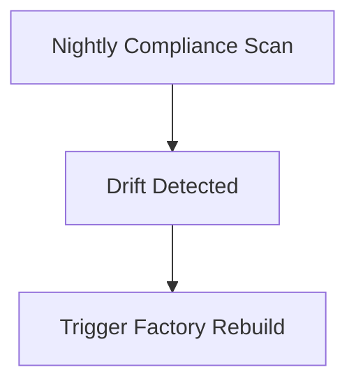

**Disaster Recovery Topology:**
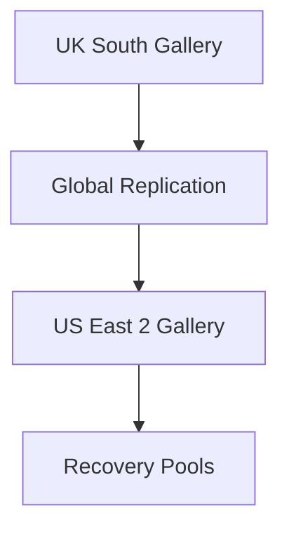

### 11. Metadata Lake for Forensic Image Audit
Storing long-term records of every image integration event (metadata), every packer build executed, and every monitoring telemetry for institutional record-keeping and forensic analysis.

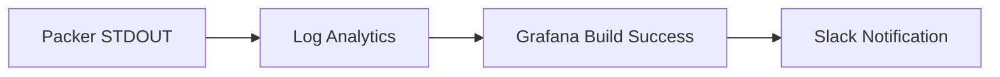

---

## 🏛️ Core Governance Pillars

1.  **Unified Foundation Coordination**: Maximizing resilience by centralizing all image measurement through a single institutional plane.
2.  **Automated Image Provisioning**: Eliminating "manual tracking" scenarios through proactive orchestration and pattern verification.
3.  **Sequential Image Intelligence**: Ensuring zero-interruption operations through dependency-aware build-driven data engineering.
4.  **Zero-Trust Identity Protection**: Automatically enforcing identity-based access, VHD encryption, and policy evaluation across all assurance tiers.
5.  **Autonomous Operations Logic**: Guaranteeing reliability through automated industry-specific effectiveness monitoring runbooks.
6.  **Full Image Auditability**: Immutable recording of every image change and packer provision for institutional forensics.

---

## 🛠️ Technical Stack & Implementation

### Image Engine & APIs
*   **Framework**: Python 3.11+ / FastAPI.
*   **Performance Engine**: Custom Python-based logic for multi-cloud image reconciliation and DORA-style EUC metrics.
*   **Integrations**: Native connectors for HashiCorp Packer, Azure Compute Gallery, and CIS Benchmarks.
*   **Persistence**: PostgreSQL (Image Ledger) and Redis (Live Build State).
*   **Auth Orchestrator**: Federated OIDC/SAML for least-privilege image management access.

### Governance Dashboard (UI)
*   **Framework**: React 18 / Vite.
*   **Theme**: Dark, Slate, Indigo (Modern high-fidelity productivity aesthetic).
*   **Visualization**: D3.js for delivery topologies and Recharts for ROI velocity analytics.

### Infrastructure & DevOps
*   **Runtime**: AWS EKS or Azure Kubernetes Service (AKS) for management plane.
*   **Measurement Hub**: Managed event sourcing for immutable productivity timeline reconstruction.
*   **IaC**: Modular Terraform for deploying the image landing zone and validation fleet.

---

## 🏗️ IaC Mapping (Module Structure)

| Module | Purpose | Real Services |
| :--- | :--- | :--- |
| **`infrastructure/image_hub`** | Central management plane | EKS, PostgreSQL, Redis |
| **`infrastructure/enforcers`** | Distributed image provisioners | Azure, AWS, GCP APIs |
| **`infrastructure/image_pipes`** | Data Ingestion Hubs | Webhooks, Lambda |
| **`infrastructure/auditing`** | Forensic modernization sinks | S3, Athena, Quicksight |

---

## 🚀 Deployment Guide

### Local Principal Environment
```bash
# Clone the AVD Image Factory repository
git clone https://github.com/devopstrio/avd-image-factory.git
cd avd-image-factory

# Configure environment
cp .env.example .env

# Launch the Image stack
make init

# Trigger a mock image update and automated guardrail validation simulation
make simulate-image
```

Access the Management Portal at `http://localhost:3000`.

---

## 📜 License
Distributed under the MIT License. See `LICENSE` for more information.

---
<div align="center">
  <p>© 2026 Devopstrio. All rights reserved.</p>
</div>
